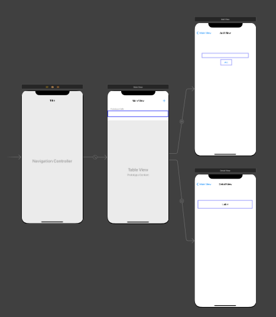
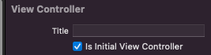
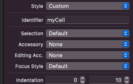

---

layout: single
classes: wide
title:  "12장 스위프트 과제"
---

# 테이블 뷰 컨트롤러 목록 만들기

{: .notice--info}

**[공지사항]**[스위프트 과제 다운로드 주소 이동.](https://github.com/softwarej1/Swift_source_code/)

흔히들 사용하고 있는 앱에 목록 기능을 만들어 보도록 할 건데, 이 목록 기능은 테이블 뷰 컨트롤러(Table View Controller)라는 기능을 추가해서 만들어 보도록 하겠습니다.


### 테이블 뷰 컨트롤러란?

흔히들 알람, 메일, 연락처 등이 테이블 뷰 컨트롤러의 기능을 합니다.

밑에 이미 구현해 둔 사진을 보시면 이해 하실 수 있을 텐데 연락처를 보시면 목록을 삭제하거나 추가하실 수 있고 목록을 누르면 추가정보를 확인할 수 있는 것을 아실 것입니다.

그 중 테이블 뷰 컨트롤러는 한 휴대폰 화면에서 여러 화면을 접근을 할 수 있도록 도와주는 기능이라 생각하시면 됩니다.


     


### 기본 환경구성

프로젝트를 만드신 후 기본 뷰 컨트롤러를 삭제하셔야 됩니다.

삭제한 다음 ViewController.swift 파일도 같이 삭제하시면 텅 빈 스토리보드만이 보이게 됩니다.



위 사진와 같이 화면 구성을 하실 건데 먼저 첫번째로 테이블 뷰 컨트롤러를 추가해야 합니다.

Library +버튼을 클릭한 후 Table View Controller를 검색하여 스토리보드에 끌어 놓고 내비게이션 컨트롤러를 추가하셔야 됩니다. 상단 위에 Editor를 누르신 다음 Embed in -> Navigation Controller를 선택하시면 위 사진 왼쪽 부분 2개는 완성 했습니다.


여기서 설정을 해주셔야 되는 부분이 스토리보드에 왼쪽 첫번째 화면을 클릭한 후 오른쪽 인스펙터 영역의 Attributes inspector오른쪽에서 3번째 부분을 클릭한 후 View Controller 부분에 is initial View Controller 부분을 체크 해주셔야 됩니다.



다음 하실 부분은 오른쪽 스토리부분 두개를 추가해야 합니다. 뷰 컨트롤러를 추가해야 되는데 스토리부분 Libray +버튼을 클릭한 후에 View Controller를 추가로 스토리 보드 위에 올려 놓습니다.


다음 뷰 전환 버튼을 추가해야 합니다. Library 버튼을 클릭 후 팝업 창에서 Bar Button Item을 찾아서 테이블 뷰에 넣으시면 됩니다.  버튼을 화면에 연결을 해 줘야 되는데 command 키를 누른 다음에 원하는 화면에 연결해서 나타나는 화면 중 Action Segue에서 Show를 선택하시면 화살표로 연결된 스토리보드가 나오는 것을 보게 될 것입니다.

나머지 부분은 스토리보드 부분은 화면을 꾸미거나 버튼이나 텍스트 추가 부분이라 생략합니다. 위 사진 보시고 따라하시면 됩니다.

추가 하실 때 한 가지 유의점은 왼쪽에서 2번째 뷰에서 Prototype Cells을 선택 후 인스펙터 영역에서 Attributes inspector 버튼을 클릭 후에 Identifier에 myCell로 지정해줘야 됩니다.



이제 스토리보드 구성을 완료하셨다면 스위프트 파일을 추가 해야 합니다. 왼쪽 내비게이터 영역에  Table  파일영역 오른쪽 버튼을 클릭한 후 New File을 누르면 화면이 나오는데 화면 왼쪽에서 두 번째 Cocoa Touch Class를 선택합니다.  다음 화면에서 서브 클래스를 선택하면 자동으로 클래스가 바뀌니 클래스명을 생성하시면 됩니다.

같은 방법으로 클래스 2개를 더 만드시면 됩니다. 이제 다 만드시고 나면 스토리보드로 돌아가서 왼쪽 두번 째 화면 누르시고 Identity inspector 버튼을 누르시면 되는데 왼쪽에서 4번째를 누른 후 Class를 미리 만들어 뒀던 swift 파일명을 3개의 뷰 모두 1개씩 연결되게 적으시면 됩니다.

스토리보드를 비롯한 일부 나머지는 코딩 부분으로 진행 내용 생략하고 코딩 부분 설명하겠습니다.

TableViewController.swft 소스코드 부분입니다.

```swift
import UIKit

// 이미지, 목록 변수 선언 부분입니다.
var items = ["책 구매", "철수와 약속", "스터디 준비하기"]
var itemsImageFile = ["cart.png", "clock.png", "pencil.png" ]


class TableViewController: UITableViewController {
    @IBOutlet var tvListView: UITableView!
    
    override func viewDidLoad() {
        super.viewDidLoad()

        self.navigationItem.leftBarButtonItem = self.editButtonItem
        
    }
    
//리스트 데이터 다시 불러옴
    override func viewDidAppear(_ animated: Bool) {
        tvListView.reloadData()  
    }

//섹션 개수 부분입니다.
    override func numberOfSections(in tableView: UITableView) -> Int {

        return 1
    }
    
// 섹션당 열의 개수입니다.
    override func tableView(_ tableView: UITableView, numberOfRowsInSection section: Int) -> Int { 

        return items.count
    }

// items와 itemsImageFile의 값을 셀에 삽입함
    override func tableView(_ tableView: UITableView, cellForRowAt indexPath: IndexPath) -> UITableViewCell {
        let cell = tableView.dequeueReusableCell(withIdentifier: "myCell", for: indexPath)

        cell.textLabel?.text = items[(indexPath as NSIndexPath).row]
        cell.imageView?.image = UIImage(named: itemsImageFile[(indexPath as NSIndexPath).row])

        return cell
    }

// 목록 삭제 함수
    override func tableView(_ tableView: UITableView, commit editingStyle: UITableViewCell.EditingStyle, forRowAt indexPath: IndexPath) {
        if editingStyle == .delete {
            items.remove(at: (indexPath as NSIndexPath).row)
            itemsImageFile.remove(at: (indexPath as NSIndexPath).row)
            tableView.deleteRows(at: [indexPath], with: .fade)
        } else if editingStyle == .insert {

        }    
    }
    
// 삭제 시 "삭제"로 표시
    override func tableView(_ tableView: UITableView, titleForDeleteConfirmationButtonForRowAt indexPath: IndexPath) -> String? {
        return "삭제"
    }
    
// 목록 순서 바꾸기
    override func prepare(for segue: UIStoryboardSegue, sender: Any?) {

        if segue.identifier == "sgDetail"{
            let cell = sender as! UITableViewCell
            let indexPath = self.tvListView.indexPath(for: cell)
            let detailView = segue.destination as! DetailViewController
            detailView.receiveItem(items[((indexPath! as NSIndexPath).row)])
        }
    }
    

}
```

tableView.dequeueReusableCell(withIdentifier: "myCell", for: indexPath)

이 부분 소스코드의 유의사항으로는 withIdentifier 부분에 myCell로 바꿔서 넣어줘야 합니다. 스토리보드 Table View Cell 부분 Identifier 부분 이름과 같게 하셔야 에러가 안납니다.

AddViewController.swift 부분입니다.

```swift
import UIKit

class AddViewController: UIViewController {
    @IBOutlet var tfAddItem: UITextField!
    
    override func viewDidLoad() {
        super.viewDidLoad()

    }
    
    // 새 목록 추가하기
    @IBAction func btnAddItem(_ sender: UIButton) {
        items.append(tfAddItem.text!)
        itemsImageFile.append("clock.png")
        tfAddItem.text=""
        _ = navigationController?.popViewController(animated: true)
    }
    
}

```

DetailViewController.swift

```swift
import UIKit

class DetailViewController: UIViewController {
    var receiveItem = ""
    
    @IBOutlet var lblItem: UILabel!
    
    override func viewDidLoad() {
        super.viewDidLoad()

        lblItem.text = receiveItem
    }
    
    // Main View에서 변수 받아오기 위한 함수
    func receiveItem(_ item: String)
    {
        receiveItem = item
    }


}
```


## 테이블 뷰 컨트롤러 앱 실행 결과입니다.


