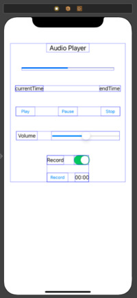

---

layout: single
classes: wide
title:  "13장 스위프트 과제"
---

# 오디오 재생 및 녹음 앱을 위한 기본 환경 구성하기

{: .notice--info}

**[공지사항]**[스위프트 과제 다운로드 주소 이동.](https://github.com/softwarej1/Swift_source_code/)

기본적인 핸드폰 어플에 들어있는 음악을 녹음하는 기능과 음악을 재생하는 기능을 만들어 보도록 하겠습니다. 여기서 필요한 함수가 AVAudioPlayer를 이용해 사용합니다.

## AVAudioPlayer란?

ios에서는 기본적으로 음악 재생 앱과 녹음 앱을 재공함으로 각종 벨소리, 알람과 같은 각종 소리와 관련된 내용을 쓸 때 사용합니다. 또는 녹음 기능을 추가해 목소리로 메모를 하는 등으로 사용합니다.

## 스토리보드 환경 구성

기본적으로 프로그래스바와 슬라이더를 등을 구성하여 스택 뷰 안에 넣었습니다. 스토리보드 환경 구성한 화면으로 참고하시면 됩니다.



스토리보드에서 딱히 설명 드릴게 없어 코드부분 소개하고 마치겠습니다.

ViewController.swift

```swift
import UIKit
import AVFoundation

class ViewController: UIViewController, AVAudioPlayerDelegate, AVAudioRecorderDelegate {
    
    var audioPlayer : AVAudioPlayer!
    var audioFile : URL!
    let MAX_VOLUME : Float = 10.0   //최대 볼륨
    var progressTimer : Timer!      //오디오 타이머
    
    let timePlayerSelector:Selector = #selector(ViewController.updatePlayTime)
    let timeRecordSelector:Selector = #selector(ViewController.updateRecordTime)
    
    @IBOutlet var pvProgressPlay: UIProgressView!
    @IBOutlet var lblCurrentTime: UILabel!
    @IBOutlet var lblEndTime: UILabel!
    @IBOutlet var btnPlay: UIButton!
    @IBOutlet var btnPause: UIButton!
    @IBOutlet var btnStop: UIButton!
    @IBOutlet var slVoulume: UISlider
// 음악 실행 부분 변수입니다.
    
    @IBOutlet var btnRecord: UIButton!
    @IBOutlet var lblRecordTime: UILabel!
// 녹음 부분 변수입니다.
    
    var audioRecorder : AVAudioRecorder!
    var isRecordMode = false

    
    override func viewDidLoad() {
        super.viewDidLoad()
        // Do any additional setup after loading the view.
        selectAudioFile()
        
        if !isRecordMode{  // 재생 모드일 때
            initPlay()
            btnRecord.isEnabled = false
            lblCurrentTime.isEnabled = false
        }
        
        else{  // 녹음 모드일 때
            initRecord()
        }
    }
    
// 재생 모드와 녹음 모드에 따라 파일 선택
    func selectAudioFile() { 
        
        if !isRecordMode{
            audioFile = Bundle.main.url(forResource: "Sicilian_Breeze", withExtension: "mp3")
        }
            else{
                let documentDirectory = FileManager.default.urls(for: .documentDirectory, in: .userDomainMask)[0]
                audioFile = documentDirectory.appendingPathComponent("recordFile.m4a")
            }
        
    }
    
    func initRecord(){  // 녹음 모드 초기화
        
        let recordSettings = [
            AVFormatIDKey : NSNumber(value: kAudioFormatAppleLossless as UInt32),
            AVEncoderAudioQualityKey : AVAudioQuality.max.rawValue,
            AVEncoderBitRateKey : 320000,
            AVNumberOfChannelsKey : 2,
            AVSampleRateKey : 44100.0 ] as [String : Any]
        
        do{
            audioRecorder = try AVAudioRecorder(url: audioFile, settings:  recordSettings)
            
        }
        catch let error as NSError{
            print("Error-initRecord : \(error)")
        }
        
        audioRecorder.delegate = self
        
        slVoulume.value = 1.0
        audioPlayer.volume = slVoulume.value
        lblEndTime.text = convertNStimeInterval2String(0)
        lblCurrentTime.text = convertNStimeInterval2String(0)
        setPlayButtons(false, pause: false, stop: false)
        
        let session = AVAudioSession.sharedInstance()
        do{
            try AVAudioSession.sharedInstance().setCategory(.playAndRecord, mode: .default)
            try AVAudioSession.sharedInstance().setActive(true)
        }
        catch let error as NSError{
            print("Error-initRecord : \(error)")
        }
        do {
            try session.setActive(true)
        }
        catch let error as NSError{
            print("Error-initRecord : \(error)")
        }
        
    }
    
    func initPlay(){          // 오디오 재생시 초기화
        
        do{
            audioPlayer = try AVAudioPlayer(contentsOf: audioFile)
        }
        catch let error as NSError{
            print("Error-initPlay : \(error)")
        }
        
        slVoulume.maximumValue = MAX_VOLUME
        slVoulume.value = 1.0
        pvProgressPlay.progress = 0
        
        audioPlayer.delegate = self
        audioPlayer.prepareToPlay()
        audioPlayer.volume = slVoulume.value
        
        lblEndTime.text = convertNStimeInterval2String(audioPlayer.duration)
        lblCurrentTime.text = convertNStimeInterval2String(0)
        setPlayButtons(true, pause: false, stop: false)
        
        btnPlay.isEnabled = true
        btnPause.isEnabled = false
        btnStop.isEnabled = false
        
    }
    func setPlayButtons(_ play:Bool, pause:Bool, stop:Bool){ // 오디오 재생, 일시정지, 정지
        
        btnPlay.isEnabled = play
        btnPause.isEnabled = pause
        btnStop.isEnabled = stop
        
    }
    
    func convertNStimeInterval2String(_ time:TimeInterval) -> String{
// 00:00 형태 문자열 변환 
        
        let min = Int(time/60)
        let sec = Int(time.truncatingRemainder(dividingBy: 60))
        let strTime = String(format: "%02d:%02d" , min, sec)
        return strTime
        
    }
    
    @objc func updatePlayTime(){
        
        lblCurrentTime.text = convertNStimeInterval2String(audioPlayer.currentTime)
        pvProgressPlay.progress = Float(audioPlayer.currentTime/audioPlayer.duration)
        
    }
    
    
    
    
    @IBAction func btnPlayAudio(_ sender: UIButton) {  // 오디오 재생 버튼
        
        audioPlayer.play()
        setPlayButtons(false, pause: true, stop: true)
        
        progressTimer = Timer.scheduledTimer(timeInterval: 0.1, target: self, selector: timePlayerSelector, userInfo: nil, repeats: true)
        
    }
    
    @IBAction func btnPauseAudio(_ sender: UIButton) {  // 오디오 일시 정지 버튼
        
        audioPlayer.pause()
        setPlayButtons(true, pause: false, stop: true)
        
    }
    
    @IBAction func btnStopAudio(_ sender: UIButton) {  // 오디오 정지 버튼
        
        audioPlayer.stop()
        audioPlayer.currentTime = 0
        lblCurrentTime.text = convertNStimeInterval2String(0)
        setPlayButtons(true, pause: false, stop: false)
        progressTimer.invalidate()
        
    }
    
    @IBAction func slChangeVolume(_ sender: UISlider) {
        audioPlayer.volume = slVoulume.value
    }
    
// 재생 종료 호출    
    func audioPlayerDidFinishPlaying(_ player: AVAudioPlayer, successfully flag: Bool) {
        
        progressTimer.invalidate()
        setPlayButtons(true, pause: false, stop: false)
        
    }
    
// 스위치 On/Off 녹음 모드, 재생 모드 결정    
    @IBAction func swRecordMode(_ sender: UISwitch) {
        if sender.isOn{  // 녹음 모드
            
            audioPlayer.stop()
            audioPlayer.currentTime = 0
            lblRecordTime!.text = convertNStimeInterval2String(0)
            isRecordMode = true
            btnRecord.isEnabled = true
            lblRecordTime.isEnabled = true
            
        }
        else{  // 재생 모드
            isRecordMode = false
            btnRecord.isEnabled = false
            lblRecordTime.isEnabled = false
            lblCurrentTime.text = convertNStimeInterval2String(0)
            
        }
        selectAudioFile()  // 오디오 파일 선택
        if !isRecordMode{
            initPlay()
        }
        else{
            initRecord()
        }
    }
    
    @IBAction func btnRecord(_ sender: UIButton) {
        if(sender as AnyObject).titleLabel??.text == "record"{
// Record일 때 녹음 중지          
            audioRecorder.record()
            (sender as AnyObject).setTitle("Stop", for: UIControl.State())
            progressTimer = Timer.scheduledTimer(timeInterval: 0.1, target: self, selector: timeRecordSelector, userInfo: nil, repeats: true)
            
        }
        
        else{ // stop일 때 녹음 초기화 
            audioRecorder.stop()
            progressTimer.invalidate()
            (sender as AnyObject).setTitle("record", for: UIControl.State())
            btnPlay.isEnabled = true
            initPlay()
        }
    }
 
// 녹음 시간 표시    
    @objc func updateRecordTime(){
        lblRecordTime.text = convertNStimeInterval2String(audioRecorder.currentTime)
    }
    
}
```


여기 소스코드에서 나온 함수로서 do-try-catch문이 있습니다. 이 함수는 오류가 발생할 수 있는 함수를 호출할 때 사용하는 함수로서 do-try에서 오류가 발생하게 될 경우 catch에서 바로 잡아줍니다.

나머지 부분은 소스코드를 따라 해보시고 익히시면 아실수 있을 겁니다.

## 오디오 재생 및 녹음 앱 실행 부분입니다.

재생, 일시정지, 정지, 녹음 기능을 포함한 부분으로 참고 바랍니다.


