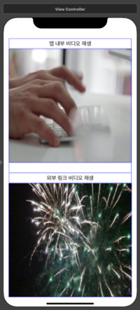

---

layout: single
classes: wide
title:  "14장 스위프트 과제"
---

# 비디오 재생 앱 만들기

{: .notice--info}

**[공지사항]**[스위프트 과제 다운로드 주소 이동.](https://github.com/softwarej1/Swift_source_code/)

이번에는 아이폰 앱에서 비디오 파일을 방법에 대해서 다루어 보도록 하겠습니다. 

## AVPlayerViewController란?

13장에서 AVAudioPlayer를 이용해 음악 재생, 녹음 관련 기능을 사용했다면 AVPlayerViewController은 유튜브처럼 화면에서 비디오를 표현해서 나타내주는 기능을 합니다. 또한 비디오 파일 뿐만 아니라 외부에서 가져온 파일도 간단하게 재생할 수 있습니다.


## 스토리보드 환경 구성

스토리보드 환경 구성으로는 레이블과 버튼으로 이루어져 환경 구성이 가능합니다. 또한 이번에도 스택을 이용하여 화면 배치를 했습니다. 사진에 넣을 부분을 버튼을 넣었으며 화면 구성을 똑같이 하시면 됩니다.




나머지 스토리보드 환경 구성은 비교적 간단함으로 넘어가겠습니다. 다음 비디오 재생 앱 만들기 소스코드입니다. AVPlayerViewController 함수 기능을 사용하기 때문에 AVkit를 정의를 해 주었습니다. 

ViewController.swift

```swift
import UIKit
import AVKit

class ViewController: UIViewController {

    override func viewDidLoad() {
        super.viewDidLoad()
       
    }

    @IBAction func btnplayInternalMovie(_ sender: UIButton) {  // 비디오 실행 버튼
        
        let filePath:String? = Bundle.main.path(forResource: "FastTyping", ofType: "mp4")
        let url = NSURL(fileURLWithPath: filePath!)
        
        playVidio(url: url)
        
        let playerController = AVPlayerViewController()
        
        let player = AVPlayer(url: url as URL)
        playerController.player = player
        
        self.present(playerController, animated: true)
        {
            player.play()
        }
    }
    
    @IBAction func btnPlayerExternalMovie(_ sender: UIButton) {  // url 실행 비디오 버튼
     
        let url = NSURL(string: "https://dl.dropboxusercontent.com/s/e38auz050w2mvud/fireworks.mp4")!
        
        playVidio(url: url)
        
        let playerController = AVPlayerViewController()
        
        let player = AVPlayer(url: url as URL)
        playerController.player = player
        
        self.present(playerController, animated: true){
            player.play()
        }
    }
    
    private func playVidio(url: NSURL){      //AVPlayerViewController 인스턴스 생성
        let playerConntroller = AVPlayerViewController()
        
        let player = AVPlayer(url: url as URL)
        playerConntroller.player = player
        
        self.present(playerConntroller, animated: true){
            player.play()
        }
    }
    
}
```

위에 소스코드에 bundle은 실행 가능한 코드와 그 코드가 사용하는 자원을 포함하고 있는 디렉토리라고 하는데 소스코드가 포함된 장소를 가르쳐주는 개념이라고 생각하시면 됩니다.

나머지 소스코드 부분은 앱 만들 때 따라해 보시면 이해 할 수 있을 것입니다.

## 비디오 앱 실행 부분입니다.


2번째 사진 부분 영상은 앱 내부 비디오 재생 영상이고 3번째 사진 부분 영상이 외부 url를 이용한 영상입니다.


