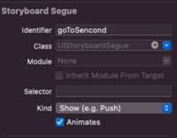

---


layout: single
classes: wide
title:  "기말 스위프트 과제"
---

# 기말 스위프트 과제

{: .notice--info}

**[공지사항]**[스위프트 과제 다운로드 주소 이동.](https://github.com/softwarej1/Swift_source_code/)

{: .notice--info}

**[공지사항]**[깃허브 블로그 주소 이동.](https://github.com/softwarej1/softwarej1.github.io)


12장에서 했던 테이블 뷰 컨트롤러를 이용한 목록 만들기를 이어서 서로 화면간 데이터 전송 내용에 대해서 해보겠습니다.

서로간 데이터 전송하기 위해서는 segue라는 함수 또는 12장에서 했던 테이블 뷰 컨트롤러로 서로간의 데이터 전송이 가능합니다. 정확히 얘기 해드리자면 지금 12장에서 cell 부분을 이용해서 AddView에서  메인 뷰 컨트롤러 변수로 데이터 이동 시킨 이후에 prepare로 detailView로 데이터를 옮겨야 됩니다. 이 방법이 어렵기 때문에 지금 할 것은 Add View 컨트롤러로 Detail View 컨트롤러로 segue를 이용해 데이터를 이동해 보도록 하겠습니다.


## segue란?

segue는 여러 뷰 컨트롤러 간에 데이터를 서로 주고 받던가 컨트롤러간의 전환시에 사용합니다.


## 스토리보드 환경 구성

 스토리보드는 밑에 사진처럼 구성해주시고 AddView 컨트롤러 segue를 detail View 컨트롤러를 이용해서 구성해주시면 됩니다.


다음 segue Identifier를 설정을 해야 합니다.




table 뷰 컨트롤러에 스토리보드 구성했을 경우 실행이 안됬는데 아마 segue랑 다른 연결된 navigation에서 충돌이 일어나서 안되는 것으로 지금 알고 있습니다. 아마 따로 네비게이션 뷰로 구성하지 않고 스토리보드를 구성하시면 되실 것입니다.

AddViewController 소스코드

```swift
import UIKit

class AddViewController: UIViewController {
    
    @IBOutlet var tfAddItem: UITextField!
    @IBOutlet var AddTextView: UITextView!

    
    
    override func viewDidLoad() {
        super.viewDidLoad()

    }
    // 새 목록 추가하기
    @IBAction func btnAddItem(_ sender: UIButton) {
        items.append(tfAddItem.text!)
        itemsImageFile.append("clock.png")
        tfAddItem.text=""
        
        performSegue(withIdentifier: "goToSecond", sender: sender)
        
        _ = navigationController?.popViewController(animated: true)
        
    }
    
    override func prepare(for segue: UIStoryboardSegue, sender: Any?) {
        if segue.identifier == "goToSecond"{
            let vc = segue.destination as! DetailViewController
            vc.labelString = "data"         //테스트용 데이터
        }
    }
    
}
```

segue를 써서 AddViewController에서 DetailViewController로 스토리보드로 보내기 위해서는 prepare라는 객체가 필요로 합니다.

사용방식은 위에 있는 방식을 참고하시면 됩니다.

DetailViewController 소스코드

```swift
import UIKit

class DetailViewController: UIViewController {
    var receiveItem = ""
    var labelString = ""
    
    
    @IBOutlet var lblItem: UILabel!
    @IBOutlet var DetailLabel: UILabel!
    
    
    
    override func viewDidLoad() {
        super.viewDidLoad()

        lblItem.text = receiveItem
        DetailLabel.text = labelString
        DetailLabel.text = labelString
        
    }
    // Main View에서 변수 받아오기 위한 함수
    func receiveItem(_ item: String)
    {
        receiveItem = item
    }

}

```


